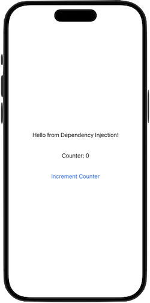

# Swift Dependency Injection Container
A lightweight dependency injection container to help manage dependencies in Swift applications. This project includes a simple SwiftUI app demonstrating how to use the dependency injection container.

## Features

- **Register Dependencies**: Easily register factories and singletons.
- **Resolve Dependencies**: Resolve registered dependencies with type safety.
- **SwiftUI Integration**: Seamlessly inject dependencies into SwiftUI views.

## Getting Started

### DependencyContainer Protocol

The `DependencyContainer` protocol defines the necessary methods for registering and resolving dependencies.

```swift
protocol DependencyContainer {
    func register<T>(type: T.Type, _ factory: @escaping () -> T)
    func registerSingleton<T>(type: T.Type, _ factory: @escaping () -> T)
    func resolve<T>(type: T.Type) -> T?
}
```

### SimpleDependencyContainer

`SimpleDependencyContainer` is a concrete implementation of the `DependencyContainer` protocol.

```swift
final class SimpleDependencyContainer: DependencyContainer {
    private var factories = [String: () -> Any]()
    private var singletons = [String: Any]()
    
    func register<T>(type: T.Type, _ factory: @escaping () -> T) {
        let key = String(describing: type)
        factories[key] = factory
    }
    
    func registerSingleton<T>(type: T.Type, _ factory: @escaping () -> T) {
        let key = String(describing: type)
        singletons[key] = factory()
    }
    
    func resolve<T>(type: T.Type) -> T? {
        let key = String(describing: type)
        if let singleton = singletons[key] as? T {
            return singleton
        }
        return factories[key]?() as? T
    }
    
    func setupDependencies() {
        self.register(type: MessageProvider.self) { SimpleMessageProvider() }
        self.registerSingleton(type: Counter.self) { Counter() }
        self.register(type: MessageViewModel.self) {
            MessageViewModel(messageProvider: self.resolve(type: MessageProvider.self)!)
        }
        self.register(type: CounterViewModel.self) {
            CounterViewModel(counter: self.resolve(type: Counter.self)!)
        }
    }
}
```

### Sample SwiftUI App



The sample SwiftUI app demonstrates how to use the `SimpleDependencyContainer` to inject dependencies into SwiftUI views.

#### Dependencies

We define the dependencies that we'll inject into our SwiftUI views.

```swift
import SwiftUI

protocol MessageProvider {
    var message: String { get }
}

class SimpleMessageProvider: MessageProvider {
    var message: String {
        return "Hello from Dependency Injection!"
    }
}

class Counter {
    private(set) var value = 0
    
    func increment() {
        value += 1
    }
}
```

#### View Models

We define the view models that use the dependencies provided by the container.

```swift
class MessageViewModel: ObservableObject {
    @Published var message: String = ""
    
    init(messageProvider: MessageProvider) {
        self.message = messageProvider.message
    }
}

class CounterViewModel: ObservableObject {
    @Published var count: Int = 0
    private let counter: Counter
    
    init(counter: Counter) {
        self.counter = counter
    }
    
    func increment() {
        counter.increment()
        count = counter.value
    }
}
```

#### SwiftUI Views

The SwiftUI views use the view models injected via the environment.

```swift
struct ContentView: View {
    @EnvironmentObject var messageViewModel: MessageViewModel
    @EnvironmentObject var counterViewModel: CounterViewModel
    
    var body: some View {
        VStack {
            Text(messageViewModel.message)
                .padding()
            
            Text("Counter: \(counterViewModel.count)")
                .padding()
            
            Button(action: {
                counterViewModel.increment()
            }) {
                Text("Increment Counter")
            }
            .padding()
        }
    }
}
```

#### App Initialization

We set up the dependency container and register the dependencies in the `App` struct.

```swift
@main
struct DependencyInjectionApp: App {
    let container = SimpleDependencyContainer()
    
    init() {
        container.setupDependencies()
    }
    
    var body: some Scene {
        WindowGroup {
            ContentView()
                .environmentObject(container.resolve(type: MessageViewModel.self)!)
                .environmentObject(container.resolve(type: CounterViewModel.self)!)
        }
    }
}
```

### Running the App

To run the sample app:

1. Clone the repository.
2. Open the project in Xcode.
3. Run the project.

### License

This project is licensed under the MIT License. See the [LICENSE](LICENSE) file for more details.

---
